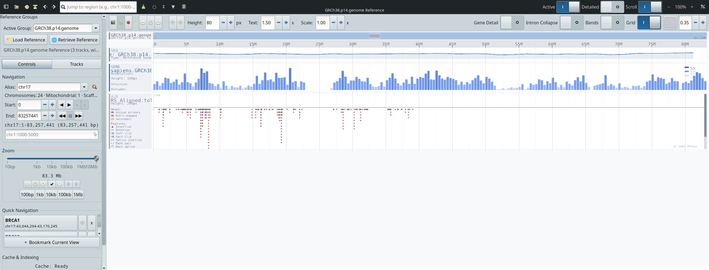
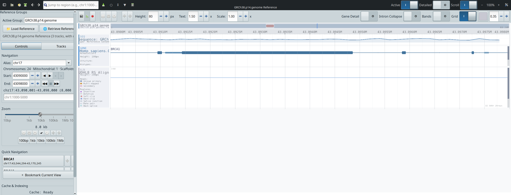
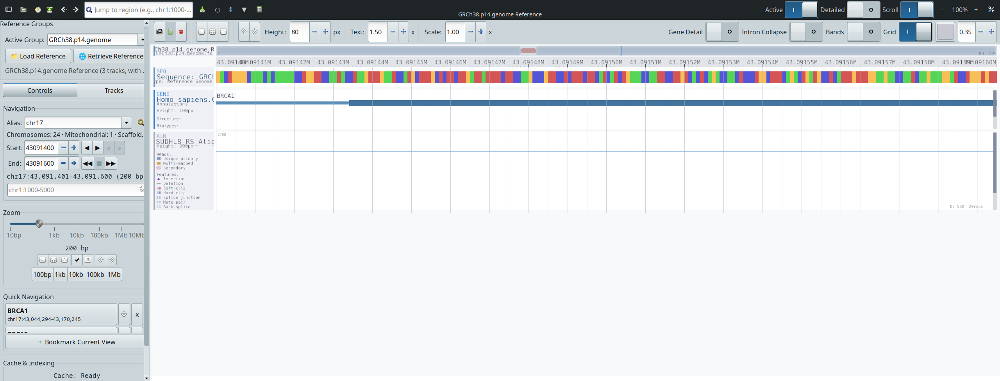
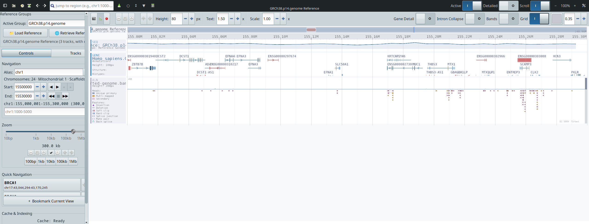
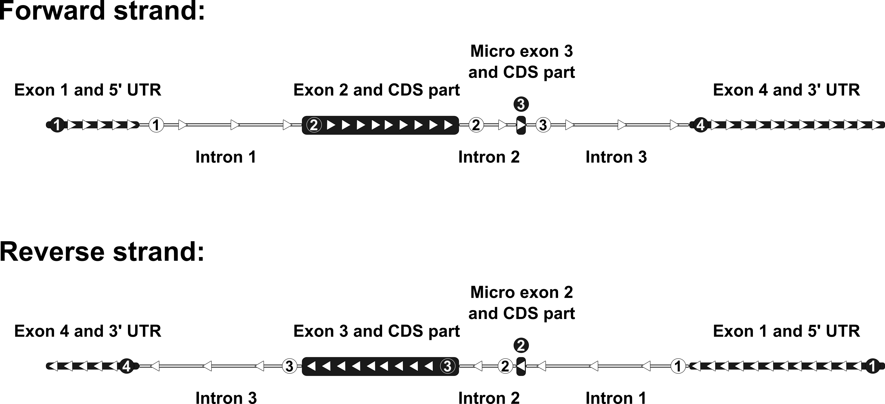

# VX: an AI-agent-controllable desktop genome and transcriptome browser with a programmable analysis framework.

> **A fast, cross-platform, GPU-accelerated desktop genome and
> transcriptome browser, built from the ground up for *AI-agent
> driven* exploration of sequencing data.**
> Visualise FASTA / GTF / GFF / BAM / BigWig / BigBed / VCF /
> Hi-C interaction tracks; run 50+ built-in computational analyses
> against them; drive the whole thing from Claude, an LLM agent,
> or a plain `curl` command through an embedded HTTP API.

<p align="center">
  
</p>

<p align="center">
  <a href="https://github.com/Arnaroo/VX/releases"></a>
  <a href="LICENSE-binaries.txt"></a>
  <a href="mcp/LICENSE"></a>
  <a href="api/LICENSE"></a>
  
</p>

---

## What VX is for

VX is a **desktop genome browser** in the family of IGV, UCSC
Genome Browser, JBrowse, Jbrowse 2, SeqMonk, Tablet, Pileup.js,
and Pretzel — but built for a different decade. It targets four
audiences that the current generation of browsers serves less
well:

1. **Researchers** working with very large sequencing datasets
   (multi-GB BAM, BigWig, Hi-C `.cool`/`.mcool`, multi-sample VCF)
   on a laptop, who need an *instantly responsive* viewer that
   doesn't lock up while a 23 GB BAM region cache warms.
2. **Bioinformaticians and computational biologists** who want
   to *run* analyses against the data while looking at it —
   peak calling, GC content, coverage anomalies, alignment QC,
   variant density, Hi-C TAD boundaries, cross-track correlation
   — directly from the viewer, in the background, with file
   exports.
3. **AI / agentic-LLM users** who want a genome browser their
   agent can *see and control*: navigate the viewport, load
   files, screenshot tracks, run analyses, export regions, all
   through a structured tool catalogue.
4. **Educators and figure-makers** who want a reproducible,
   scriptable, screenshot-and-record-ready viewer that produces
   publication-grade output (PNG, SVG, MP4 / WebM / GIF screen
   recordings) from a single binary.

If you do **NGS, RNA-seq, ChIP-seq, ATAC-seq, Hi-C, long-read
sequencing, variant calling, comparative genomics, transcript
isoform analysis, ribosome profiling, CLIP-seq, methylation
sequencing, MeRIP-seq, or any other sequencing-based assay** —
and you've ever wished your genome browser was faster, smarter,
or scriptable — VX is built for you.

---

## Why VX is different

| Capability | What it means in practice |
|---|---|
| **GPU-accelerated rendering** | OpenGL-based level-of-detail engine — render tens of thousands of features per second, smooth pan/zoom from chromosome scale (10⁸ bp) to base level (10⁰ bp) in one continuous gesture. No tile-popping. No re-fetch on every nudge. |
| **Async, background-thread BAM loading** | The viewport never blocks. Load a 23 GB BAM, click to a new region, render proceeds at full FPS while the read fetch completes in the background. A load-status strip tells you *why* the alignments aren't there yet. |
| **38+ tool MCP catalogue + HTTP API** | Built-in HTTP server on `127.0.0.1:9876`. Any tool that speaks HTTP — Claude Code, Claude Desktop, a Python script, `curl` — can drive every aspect of the viewer: navigate, load files, query genes, screenshot the viewport, run analyses, manage bookmarks, record video. AI-native by design. |
| **50+ built-in analyses** | Peak calling, RPKM/TPM/CPM quantification, GC content, CpG density, motif search, repeat density, signal correlation, variant annotation, Ts/Tv, alleles, MAPQ distribution, insert sizes, strand bias, soft-clip frequency, Hi-C contact-vs-distance, TAD boundaries, heatmap matrix, profile plots, peak prominence, gap detection — all in a background thread with file output (BED / BedGraph / TSV). |
| **Built-in video / GIF recording** | Capture the OpenGL viewport to MP4 (H.264), WebM (VP9) or GIF. Two modes: timer-paced (constant fps) or render-paced (every frame). Quality and frame rate user-controlled. Ideal for figure animations, talks, supplementary movies. |
| **Subsampling + transparency** | Alignment tracks honour a configurable read-cap (default 500 reads/region) with a `min_mapq` filter. When a region is subsampled, a *badge* on the track tells you so. The screenshot endpoint respects the same cap — figures match what you see. |
| **Self-contained binaries** | No Python runtime, no Conda environment, no JBrowse-style web stack. A single binary (~19 MB on Linux, ~45 MB macOS, ~46 MB Windows zip) with all GUI deps either bundled (Win/Mac) or relying on a baseline desktop install (Linux). Drop, double-click, run. |
| **Triple-platform pre-compiled** | Linux x86_64 (4 CPU-profile binaries), macOS arm64 `.app` + `.dmg`, Windows x86_64 ZIP. Built with the LDC LLVM-based D compiler, full LTO, static druntime + Phobos. |
| **No telemetry, no cloud, no account** | VX is a desktop application. It does not phone home. The HTTP API binds only to `127.0.0.1` by default. Your data stays on your machine. |

If you've used IGV and wished it were faster, or JBrowse and
wished it weren't a browser tab, or Pileup.js and wished it ran
big files, or any genome browser and wished an AI agent could
drive it — VX is the answer.

---

## Screenshots

<table>
<tr>
<td></td>
<td></td>
</tr>
<tr>
<td align="center"><em>Chromosome-scale overview — 1 ideogram + multiple tracks rendered at 10⁸ bp resolution.</em></td>
<td align="center"><em>Gene boundaries with intron-collapse for fast structure inspection.</em></td>
</tr>
<tr>
<td></td>
<td></td>
</tr>
<tr>
<td align="center"><em>Gene-level detail with transcript isoforms.</em></td>
<td align="center"><em>Exon-level detail showing UTRs, CDS, splice sites.</em></td>
</tr>
<tr>
<td></td>
<td></td>
</tr>
<tr>
<td align="center"><em>Base-level resolution with codon highlighting and frame translation.</em></td>
<td align="center"><em>Dark mode for long sessions / projector-friendly figures.</em></td>
</tr>
<tr>
<td></td>
<td></td>
</tr>
<tr>
<td align="center"><em>Multi-track composition: sequence + genes + coverage + alignments + signal + variants.</em></td>
<td align="center"><em>Anatomy of a gene track — UTRs, exons, introns, strand arrows.</em></td>
</tr>
</table>

---

## Quick install

### 1. Download the right binary for your platform

Visit the **[Releases page](https://github.com/Arnaroo/VX/releases)**
and grab one asset for your system:

| Platform | Asset | Size |
|---|---|---|
| **Linux x86_64** (Haswell-class or newer; AVX2/BMI2/FMA) | `VX-X.Y.Z-linux-x86_64.tar.gz` | ~6.6 MB |
| **macOS arm64** (Apple Silicon, macOS 13+) | `VX-X.Y.Z-macos-arm64.dmg` | ~18 MB |
| **Windows x86_64** (Windows 10 22H2 or Windows 11) | `vx-X.Y.Z-windows-x86_64.zip` | ~46 MB |

Each asset has a matching `.sha256` sidecar. Verify before
running:

```bash
sha256sum    -c VX-X.Y.Z-linux-x86_64.tar.gz.sha256        # Linux
shasum -a 256 -c VX-X.Y.Z-macos-arm64.dmg.sha256           # macOS
certutil -hashfile vx-X.Y.Z-windows-x86_64.zip SHA256      # Windows
```

### 2. Unpack / install

**Linux** — relocatable tarball:
```bash
tar xzf VX-X.Y.Z-linux-x86_64.tar.gz
cd vx-linux/
./bin/genome-viewer
```
Linux dependencies are expected to be present from a baseline
GNOME / KDE / XFCE desktop install: `glibc 2.28+`, `GTK 3.24+`,
`GLib 2.60+`, `Cairo`, `Pango`, `freetype`, `libepoxy`, an
OpenGL driver (`libGL.so.1`).
- Ubuntu 20.04+: `sudo apt install libgtk-3-0 libgl1 libepoxy0`
- Fedora 35+ / RHEL 9: `sudo dnf install gtk3 mesa-libGL libepoxy`
- Arch / Manjaro: `sudo pacman -S gtk3 libepoxy mesa`

**macOS arm64** — `.dmg` installer:
1. Double-click `VX-X.Y.Z-macos-arm64.dmg`.
2. Drag `VX.app` into the `Applications` folder.
3. First launch: right-click `VX.app` → **Open** (Gatekeeper
   one-time confirmation; the bundle is ad-hoc signed only,
   no Developer ID).
4. Or, from Terminal:
   `xattr -dr com.apple.quarantine /Applications/VX.app`

**Windows x86_64** — relocatable ZIP:
1. Extract `vx-X.Y.Z-windows-x86_64.zip` anywhere.
2. Double-click `genome-viewer.exe` inside the extracted folder.
3. Windows SmartScreen may warn on first launch (unsigned). Click
   *More info* → *Run anyway*.

### 3. Verify it works

VX exposes an HTTP API on `127.0.0.1:9876`. From any shell:

```bash
curl -s http://127.0.0.1:9876/ping
# → {"status":"ok","app":"VX Genome Viewer","api_version":2}
```

That's your installation smoke-test.

---

## Drive VX from Claude or any LLM (MCP)

VX ships with an open-source MCP server
([`mcp/vx_mcp_server.py`](mcp/vx_mcp_server.py), MIT) that
exposes the entire viewer to AI agents that speak the
**Model Context Protocol**: Claude Code, Claude Desktop, and any
MCP-compatible client.

```bash
# One-time setup
pip install httpx fastmcp

# Then in your Claude Code config (or Claude Desktop config):
#   "vx": { "command": "python", "args": ["/path/to/vx_mcp_server.py"] }
```

See [`mcp/INSTALL.md`](mcp/INSTALL.md) for the full Claude
Desktop / Claude Code JSON snippets and
[`api/examples/claude_mcp_recipes.md`](api/examples/claude_mcp_recipes.md)
for seven worked agent recipes (BRCA1 figure, coverage walk, GC
analysis, subsampled-BAM inspection, bookmark tour, SVG export,
video recording).

---

## Drive VX from a script (HTTP API)

Every MCP tool is also a plain HTTP endpoint. The full schema is
[`api/openapi.yaml`](api/openapi.yaml) (OpenAPI 3.1, validated).
Three runnable examples:

- **bash + curl:** [`api/examples/curl_navigate.sh`](api/examples/curl_navigate.sh)
- **Python (stdlib only):** [`api/examples/python_client.py`](api/examples/python_client.py)
- **Claude agent recipes:** [`api/examples/claude_mcp_recipes.md`](api/examples/claude_mcp_recipes.md)

```bash
# Navigate to BRCA1
curl -X POST -H 'Content-Type: application/json' \
     -d '{"command":"navigate","params":{"chromosome":"17","start":43044295,"end":43125483}}' \
     http://127.0.0.1:9876/command

# Screenshot the viewport at 2x scale
curl -s 'http://127.0.0.1:9876/screenshot/viewport?scale=2.0' \
     -o brca1.png

# Run a peak-calling analysis on the visible region
curl -X POST -H 'Content-Type: application/json' \
     -d '{"command":"run_analysis","params":{"analysis":"SimplePeakCalling","tracks":["ChIP_signal"]}}' \
     http://127.0.0.1:9876/command
```

---

## What you get out of the box

### Built-in computational analyses (50+, all in background thread)

**Signal & quantification:** `SignalDifference`, `SignalRatio`,
`ZScoreNormalization`, `RPKM`, `TPM`, `CPM`, `PerExonCoverage`,
`BinStatistics`, `RegionDifferential`

**Peak calling & enrichment:** `SimplePeakCalling`,
`EnrichmentOverInput`, `FeatureProminence`, `CoverageAnomalies`,
`VariantDensityHotspots`, `GapDetection`

**Sequence:** `GCContent`, `CpGDensity`, `MotifSearch`,
`RepeatDensity`, `NucleotideFrequency`

**Intervals:** `IntervalIntersection`, `IntervalSubtraction`,
`IntervalUnion`, `ClosestFeature`, `FeatureCounts`

**Variants:** `VariantAnnotation`, `TsTvRatio`, `VariantDensity`,
`AlleleFrequencySpectrum`, `VariantIntersection`, `CodingImpact`

**Alignment QC:** `MappingQualityDistribution`,
`InsertSizeDistribution`, `StrandBias`, `DuplicateRate`,
`SoftClipFrequency`, `ChimericReadDensity`, `ReadLengthDistribution`,
`PerBaseMismatchRate`

**Hi-C / interaction:** `ContactFrequencyVsDistance`,
`InteractionEnrichment`, `TADBoundaryDetection`

**Cross-track:** `SignalCorrelation`, `SignalAtFeatures`,
`HeatmapMatrix`, `ProfilePlotData`

Each analysis writes BED / BedGraph / TSV / CSV output to a
configurable results directory and can optionally create a new
track from the result.

### File formats supported

**Sequence:** FASTA, FASTA.gz, indexed FASTA (`.fai`).
**Annotation:** GTF, GFF3, GFF, GFF.gz.
**Alignments:** BAM (with `.bai` index), CRAM (limited).
**Signal:** BigWig, BedGraph.
**Intervals:** BED, BED.gz, BigBed.
**Variants:** VCF, VCF.gz (with `.tbi` index).
**Interaction:** Hi-C contact matrices (`.cool`, `.mcool`, planned).

See [`docs/FILE_FORMATS.md`](docs/FILE_FORMATS.md) for the full
matrix.

### Export formats

**Static:** PNG (full window, viewport, single-track), SVG
(vector — viewport, single-track), BED / BedGraph / TSV / CSV
(analysis output), session save / restore.
**Animated:** MP4 (H.264), WebM (VP9), GIF — direct viewport
capture via ffmpeg pipe.

---

## Known limitations in v0.9.0

These are documented up front so you can decide whether v0.9.0
fits your workflow.

- **Windows ZIP** ships a console-subsystem build — launching from
  Explorer opens a cmd window alongside the GUI. Cosmetic only;
  the GUI itself works identically. A no-console (GUI subsystem)
  build is planned for v0.9.x.
- **Windows `.exe` installer** is not included in v0.9.0
  (Inno Setup workflow needs further work on the build host).
  ZIP-only Windows distribution for this release.
- **macOS bundle** is ad-hoc signed only (no Developer ID,
  no notarisation). First launch requires right-click → Open
  to clear the one-time Gatekeeper confirmation. The HTTP API
  and the relocatable bundle pass smoke tests; full GUI
  verification on physical Apple Silicon is pending (current
  testing has been on a software-rendered VM tier).
- **First-region BAM fetch** on cold ≥20 GB BAMs can take ~2 min
  while the OS warms the BAM index page cache. The load-status
  strip surfaces this to the user; subsequent regions are fast.
- **No web/cloud version.** VX is a desktop application. If you
  need an embeddable browser-tab viewer, JBrowse 2 may suit you
  better.

See [`docs/TROUBLESHOOTING.md`](docs/TROUBLESHOOTING.md) for
runtime troubleshooting.

---

## Repository layout

This repository is the **public-facing distribution tree** for
VX. The D source code that produces the binaries is held in a
separate private development tree under a proprietary licence
(see *Source code* below).

| Folder | Contents | Licence |
|---|---|---|
| [`mcp/`](mcp/) | Open-source Python MCP server for Claude / agents | **MIT** |
| [`api/`](api/) | OpenAPI 3.1 HTTP API spec + curl/Python/Claude examples | **MIT** |
| [`docs/`](docs/) | User guide, file-format guide, keyboard shortcuts, troubleshooting, build provenance, screenshots | **CC-BY-4.0** |
| [`binaries/`](binaries/) | Release-asset notes + SHA-256 verification recipes | **CC-BY-4.0** |
| Pre-compiled binaries | Attached to each tagged release under [**Releases**](https://github.com/Arnaroo/VX/releases) | **CC-BY-NC-ND-4.0** |

The per-folder LICENSE matrix is reflected by `LICENSE-binaries.txt`,
`LICENSE-docs.txt`, `mcp/LICENSE`, and `api/LICENSE`.

---

## Source code

The VX D source code is **proprietary and confidential** —
held under a separate licence by Biocodecs Group / Arnaroo
Ribologicals. It is not distributed via this repository.

The pre-compiled binaries are licensed under
**CC-BY-NC-ND-4.0** (non-commercial, no-derivatives, with
attribution). For commercial licensing, OEM integration,
white-label deployment, or source-code access:
[contact@biocodecs.org](mailto:contact@biocodecs.org).

The **MCP server** ([`mcp/`](mcp/)) and the **HTTP API
specification** ([`api/`](api/)) ARE open source under MIT and
can be reused freely.

---

## Citing

If you use VX in research, please cite the accompanying
manuscript and the Zenodo DOI of the specific release you used.

```
[Citation placeholder — DOI will be added on manuscript publication.
A Zenodo DOI is minted automatically for each tagged release; see
the GitHub release page for the live DOI badge.]
```

Once the manuscript is published, this block will be replaced
with full BibTeX, plain-text, and EndNote-importable references.

---

## Build provenance

For full transparency on how each release binary was produced —
compiler version, flags, LTO settings, bundled libraries,
signing flow, recommended downstream verification — see
[`docs/BUILD_PROVENANCE.md`](docs/BUILD_PROVENANCE.md).

---

## Keywords

genome browser · transcriptome browser · sequence viewer ·
read alignment viewer · NGS · next-generation sequencing ·
RNA-seq · ChIP-seq · ATAC-seq · CLIP-seq · Hi-C · long-read
sequencing · Nanopore · PacBio · Illumina · variant viewer ·
VCF viewer · BAM viewer · GTF viewer · GFF viewer · FASTA
viewer · BigWig · BigBed · BedGraph · OpenGL · GPU-accelerated
visualisation · GTK3 · D language · LDC · cross-platform
bioinformatics · interactive genome visualisation · genome
visualization · transcriptome visualization · MCP · Model
Context Protocol · Claude · Anthropic · AI agent ·
LLM-driven analysis · agentic bioinformatics · HTTP API ·
peak calling · GC content · CpG density · motif search ·
Ts/Tv · variant density · alignment QC · MAPQ · insert size ·
strand bias · soft clip · TAD boundary · contact-vs-distance ·
heatmap · profile plot · signal correlation · feature counts ·
RPKM · TPM · CPM · coverage anomaly · gene structure · exon ·
intron · UTR · CDS · isoform · transcript · subsampling ·
async loading · video recording · screenshot · screencast ·
SVG export · reproducible figures · publication-grade ·
desktop bioinformatics · IGV alternative · JBrowse alternative ·
Tablet alternative · SeqMonk alternative · Pileup.js alternative.
